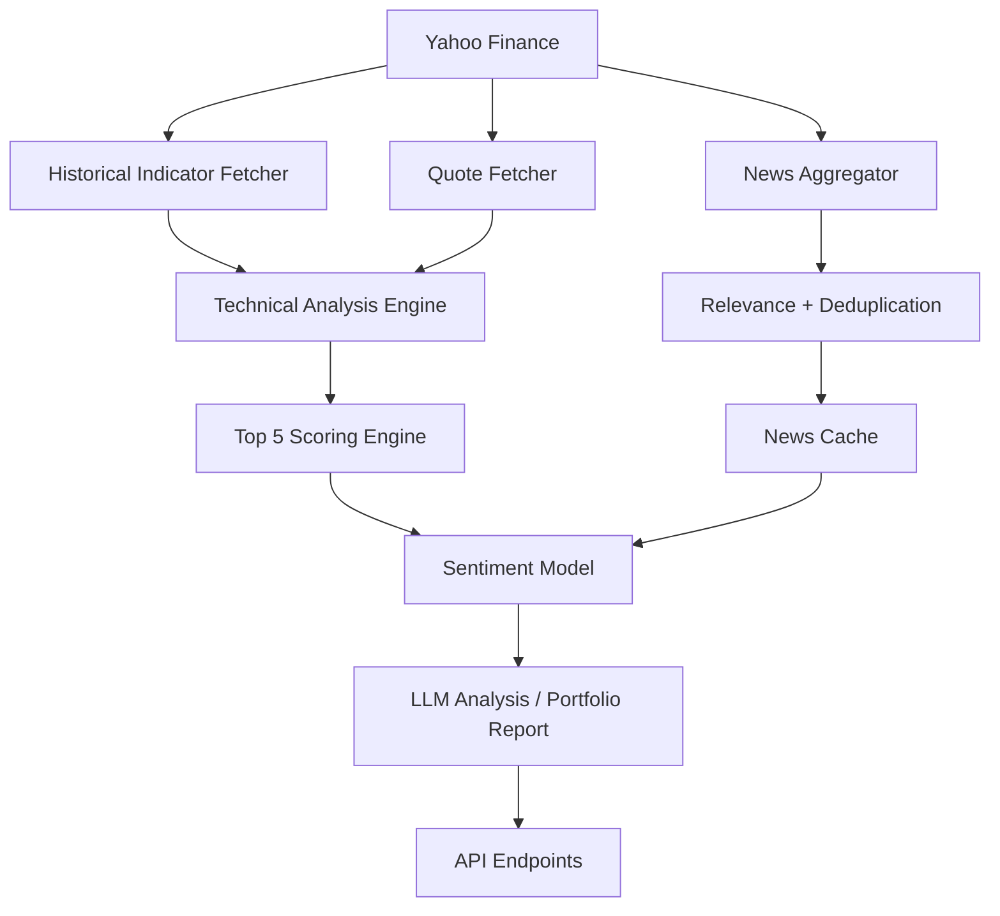

# Screener_UI System Overview

## 1. High-level pipeline

The system follows this data flow:

1. **Yahoo Finance**
   - Fetches price quotes, intraday data, historical OHLCV, and company fundamentals.
2. **Technical Analysis**
   - Computes momentum, RSI, MACD, moving averages, ATR, VWAP proxy, support/resistance, and volume metrics.
3. **News Aggregator**
   - Collects news from multiple sources:
     - `GNews` (Google News API wrapper)
     - RSS feeds (Economic Times, Moneycontrol, Business Standard, Mint, Hindu BusinessLine)
     - Yahoo Finance news via `yfinance.Ticker(ticker).news`
   - Deduplicates, scores relevance, and caches results per symbol.
4. **Sentiment Model**
   - Derives sentiment signals from analyst recommendations and news relevance.
   - Uses a weighted scoring engine to rank stocks and label momentum/technical quality.
5. **LLM Analysis**
   - Uses LangChain + Ollama to generate portfolio-level analysis and stock sentiment summaries.

## 2. Key backend modules

### `backend/fetchers.py`
- `fetch_quotes(tickers)`
  - Uses `yfinance.download()` for daily and 5-minute intraday data.
  - Builds quote rows with `open`, `high`, `low`, `close`, `volume`, `change_pct`, and timestamps.
- `fetch_historical_indicators(ticker)`
  - Downloads 3 months of daily history.
  - Calculates indicators using `pandas_ta`: `rsi`, `macd`, `ema9`, `ema20`, `sma50`, `atr`, `vwap`, `avg_volume_20`, `relative_volume`, `momentum_5d`, `gap_pct`, `support`, `resistance`.
- `fetch_info(tickers)`
  - Fetches company metadata from `yfinance.Ticker(ticker).info`.

### `backend/scoring.py`
- `_score_stock(q, fi, indicators)`
  - Computes a composite score from:
    - Momentum (20%)
    - Relative volume (15%)
    - Breakout strength (15%)
    - RSI quality (10%)
    - MACD trend confirmation (10%)
    - Moving average alignment (10%)
    - Volatility/ATR suitability (10%)
    - Liquidity (5%)
    - News/Sentiment (5%)
- `_calculate_risk_metrics(q, fi, indicators)`
  - Creates buy zone, stop loss, target, risk/reward ratio, and confidence.
- `_signal(score)`
  - Converts final score to `Strong Buy`, `Buy`, `Hold`, or `Avoid`.

### `backend/news_service.py`
- `NewsService`
  - Loads multiple sources and runs them in parallel with thread pooling.
  - Caches results in-memory for warm Lambda instances.
  - Uses a circuit breaker per source to avoid repeated failures.
- News sources:
  - `_src_gnews(stock, timeout)`
  - `_src_rss(publisher, url, stock, timeout)`
  - `_src_yfinance(stock, _timeout)`
- Relevance scoring uses stock symbol, cleaned company name, sector, and industry.

### `backend/app/portfolio_analysis.py`
- Defines `StockSentiment` and `PortfolioAnalysisResponse` Pydantic models.
- `_init_ollama_llm()`
  - Connects to local Ollama on `http://localhost:11434`.
- `analyze_portfolio(portfolio, stock_details)`
  - Builds a prompt with stock list and details.
  - Calls the LLM and parses structured JSON.
  - Returns an overall portfolio health view, stock-level sentiment, and important news.

### `backend/app/main.py`
- Exposes FastAPI endpoints for:
  - `/api/refresh` — refresh quotes or full dataset.
  - `/api/v1/insights/top5` — compute top 5 recommended stocks.
  - `/api/v1/portfolio/analysis` — analyze a default portfolio via Ollama.
  - `/api/v1/portfolio/top5-analysis` — analyze current top 5 stock picks via Ollama.
- Runs `NewsService` at startup.
- Uses `compute_top5()` to collect scores, news, and market summary.

## 3. System flow

## 4. What this document covers

- How market data is collected from Yahoo Finance.
- How technical indicators are computed.
- How news is aggregated from GNews, RSS, and Yahoo Finance.
- How the scoring engine blends technical and sentiment signals.
- How the LLM layer adds narrative analysis.

## 5. Deployment notes

- Backend dependencies are in `backend/requirements.txt`.
- Run the backend from `backend/main.py`.
- Ollama must be running locally for `/api/v1/portfolio/analysis` and `/api/v1/portfolio/top5-analysis`.
- RSS and GNews are the main news sources implemented today.
- Finnhub/Tavily are not currently implemented in code; they would require additional API connectors.

## 6. Important files

- `backend/fetchers.py`
- `backend/scoring.py`
- `backend/news_service.py`
- `backend/app/main.py`
- `backend/app/portfolio_analysis.py`
- `backend/config.py`
- `backend/requirements.txt`

## 7. Notes on current implementation

- The current pipeline uses local Ollama for advanced sentiment synthesis.
- Analyst sentiment is partially inferred from `recommendationKey` inside `yfinance` info.
- News relevance is based on company symbol, simplified name matching, and source freshness.
- The model is designed for Indian equity tickers (`*.NS`) and uses Nifty 500 as the default universe.
